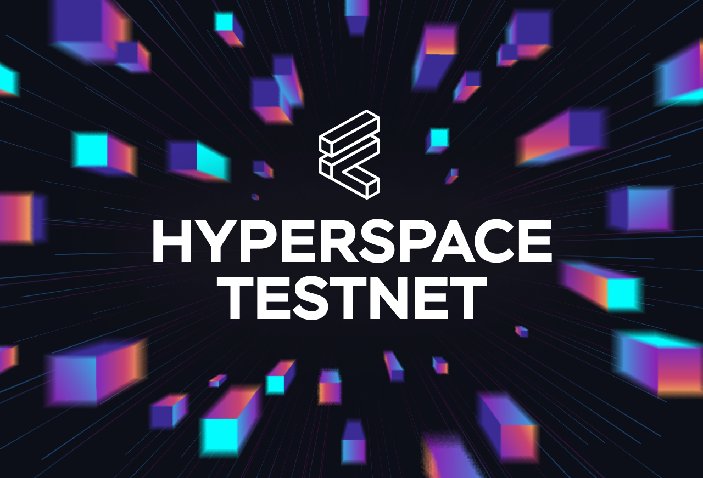

# Hyperspace Testnet

Hyperspace launched on Jan 16, 2023 and upgraded on Jan 18, 2023.

Meta info about the Hyperspace testnet for Filecoin developers



&nbsp;

## Overview

The Filecoin Hyperspace testnet is a stable testnet with fewer resets intended for developers' longer-term testing efforts.

- As of Jan 16, Hyperspace will support the penultimate FEVM release, and will be upgraded to the the final FEVM release on Feb 2. ([List of FEVM releases](https://github.com/filecoin-project/ref-fvm/issues/692))
- Hyperspace will support `512 MiB`, `32 GiB`, and `64 GiB` sectors with 2 miners auto-accepting new deals from developers.
- A comparison of Filecoin's various testnets is available in [FIP #544](https://github.com/filecoin-project/FIPs/discussions/544).


&nbsp;

## Quickstart

1. Add the Hyperspace testnet to your wallet (e.g. MetaMask).
    - Go to https://chainlist.org/chain/3141
    - Click on "Connect wallet"
2. Create a new account in MetaMask to use with Filecoin.
3. Use https://hyperspace.filtest.network/#faucet to request funds to your Ethereum address (it will be converted behind the scenes to a Filecoin f4 address)
4. Follow the transaction in one of the recommended Hyperspace testnet explorers: [:warning: TODO - update]
    - https://hyperspace.filfox.info/en 
    - https://explorer.glif.io/?network=hyperspace (or select Hyperspace from the networks dropdown)
5. Your account is now funded and can be used in Ethereum tools such as Hardhat, Foundry, Remix, etc.

## Technical details

**Maintainer:** @f8-fil-ops

**Genesis**:

- CAR File: `Qmbu9g75GMjbokCNHPQPXAyKZoY8NqVYtkY4PQT7Zvp2T6`
- Reset Timestamp: `2023-01-16T6:00:00Z`
- Genesis Block CID: `bafy2bzacebqfpeylmrl4h3pq4ofbdj2bfbw2i45fuy6qm4wxcyebpsxhrpqhu`
- sha1 Digest: `52d82b6fcad138a726477152ff2543a91f2b83f8`

**Network parameters**:

- Supported Sector Sizes: `512 MiB` and `32 GiB` and `64 GiB`
- Consensus Miner Min Power: `16 GiB`
- Epoch Duration Seconds: `30`
- Expected Leaders per Epoch: `5`
- WindowPoSt Proving Period: `2880`
- WindowPoSt Challenge Window: `60`
- WindowPoSt Period Deadlines: `48`
- Pre-Commit Challenge Delay: `10`

**Bootstrap peers**:

```
/dns4/de0.bootstrap.hyperspace.yoga/tcp/31000/p2p/12D3KooWRiwg6EHAJMR5w3DZTgpS5W4ncWPSVP2Mr1o4ey1RYSQo
/dns4/de1.bootstrap.hyperspace.yoga/tcp/31000/p2p/12D3KooWM9HZsp1bh5jNu2m9FBSbkKSeSWUPPuDBQiiMfPDBAK3U
/dns4/au0.bootstrap.hyperspace.yoga/tcp/31000/p2p/12D3KooWLup1gTdG9ipt3bSUyPCmM4CT86p9nNe12oqrCX8Zo8Na
/dns4/ca0.bootstrap.hyperspace.yoga/tcp/31000/p2p/12D3KooWNJ4evKioh6gexD4fyvyeFecNtp2oTEPTyp3jtSQ3pWaP
/dns4/sg0.bootstrap.hyperspace.yoga/tcp/31000/p2p/12D3KooWCENec46HHByaJKzbjSqz9TqVdSxSAdi9FKNwdMvfw3vp
```

:warning: **Under Construction** - More updates below coming soon :warning:

**FVM release**:

- [FVM M2.1 Carbonado.2 (rr11)](https://github.com/filecoin-project/ref-fvm/issues/1371)
- Lotus commit: [2a3989e4bd446b7f6ccee52ad6387b937072cf7f](https://github.com/filecoin-project/lotus/commit/2a3989e4bd446b7f6ccee52ad6387b937072cf7f)
- [List of FVM releases](https://github.com/filecoin-project/ref-fvm/issues/692)

**Resources**:

- Slack Channel for Updates: [#fil-net-hyperspace-discuss](https://filecoinproject.slack.com/archives/C04JEJB82RY)

- **Hyperspace Docs**: [https://kb.factor8.io/en/docs/filecoin/testnets/hyperspace](https://kb.factor8.io/en/docs/filecoin/testnets/hyperspace)
- **Faucet**: https://hyperspace.filtest.network/#faucet
- **Block Explorers**:
  - [https://hyperspace.filfox.info/en](https://hyperspace.filfox.info/en)
  - [https://explorer.glif.io/actor/?network=hyperspace](https://explorer.glif.io/actor/?network=hyperspace)
- **Filecoin CID Checker**: [https://hyperspace.filecoin.tools/](https://hyperspace.filecoin.tools/) - check your deal CID’s storage status
- **RPC - Public Endpoints**:
  - These endpoints are limited to all read-only Filecoin RPC API calls + `MPoolPush` (for sending already signed messages)
  - **Glif Nodes RPC:**
    - https://api.hyperspace.node.glif.io/rpc/v0 (for stable API v0)
    - web socket endpoint: wss://wss.hyperspace.node.glif.io/apigw/lotus/rpc/v0
  - **ChainStack RPC:**
    - https://filecoin-hyperspace.chainstacklabs.com/rpc/v0
    - wss://ws-filecoin-hyperspace.chainstacklabs.com/rpc/v0
    - Info page: https://chainstack.com/labs/#filecoin
   - **Ankr RPC:**
    - Coming Soon
- **Hyperspce SPs auto-accepting storage deals:**
  - See [Deal Miners section in the Hyperspace Docs](https://kb.factor8.io/en/docs/fil/hyperpsace#deal-miners)
- **MetaMask** (HowTo):
  - Open MetaMask and add a new network:
    - Name: Filecoin Hyperspace
    - RPC URL: https://api.hyperspace.node.glif.io/rpc/v0 (once the public RPC has been updated, otherwise use appropriate private URL - **please see the note below**)
    - ChainID: [**3141**](https://github.com/ethereum-lists/chains/blob/master/_data/chains/eip155-3141.json) (Filecoin - Hyperspace testnet)
    - Currency symbol: tFIL (Test FIL).
  - Create a new account in MetaMask to use with Filecoin.
  - (OPTIONAL - the faucet accepts 0x style addresses now) Go to https://explorer.glif.io/ethereum/, and select the account to see its f4 address.
  - Use the [faucet](https://hyperspace.filtest.network/#faucet) to draw funds to your f4 (0x style addresses are translated automatically to f4's in the backend) or alternatively use `lotus send` to transfer funds to the f4 address.
  - Wait until the transaction process, and verify that the funds appear in MetaMask.
  - Create another new account in MetaMask, (optional) obtain its f4 address again.
  - Use MetaMask to send funds from your first account to your second account.
  - **Notes on MM**
    - Note that you may need to increase the gas limit manually because there's something strange going on with gas estimation at the moment.
  - **Note on GLIF**:
    - The GLIF explorer seems to have some problems with f4 addresses right now, please refer to the #fil-net-hyperspace-discuss for questions/solutions


<hr>

:warning: [TODO - SAMPLE INFO BELOW] :warning:

- [Latest chain snapshot (pruned)](https://fil-chain-snapshots-fallback.s3.amazonaws.com/mainnet/minimal_finality_stateroots_latest.car)
- [Latest chain snapshot (full)](https://fil-chain-snapshots-fallback.s3.amazonaws.com/mainnet/complete_chain_with_finality_stateroots_latest.car)
- [Status page and incidents](https://filecoin.statuspage.io/)
- [Stats dashboard](https://stats.filecoin.io/)
- [Block explorer: Filscan](https://filscan.io/)

:warning: [TODO - SAMPLE INFO ABOVE] :warning:
